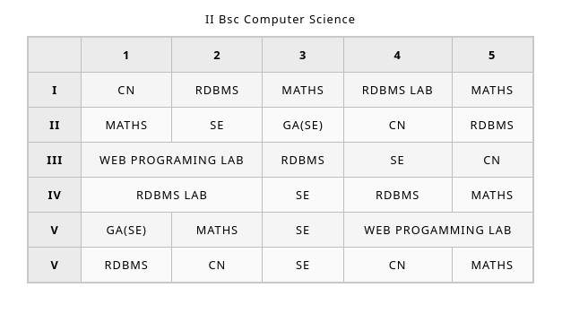

<h1 align=center><b>Creating Time Table via HTML & CSS</b></h1>

<br>

## **HTML**
```html

<!DOCTYPE html>
<html lang="en">
  <head>
    <meta charset="utf-8">
    <meta name="viewport" content="width=device-width">
    <title>II Bsc.CS Time Table</title>
    <link href="styles.css" rel="stylesheet" type="text/css">
  </head>
  <body>

    <table>
      <caption>
        II Bsc Computer Science
      </caption>
        <thead>
        <tr>
            <th></th>
            <th scope="col">1</th>
            <th scope="col">2</th>
            <th scope="col">3</th>
            <th scope="col">4</th>
            <th scope="col">5</th>
        </tr>
        </thead>
        <tbody>

        <tr>
            <th scope="row">I</th>
            <td>CN</td>
            <td>RDBMS</td>
            <td>MATHS</td>
            <td>RDBMS LAB</td>
            <td>MATHS</td>
        </tr>

        <tr>
          <th scope="row">II</th>
          <td>MATHS</td>
          <td>SE</td>
          <td>GA(SE)</td>
          <td>CN</td>
          <td>RDBMS</td>
        </tr>

        <tr>
          <th scope="row">III</th>
          <td colspan="2">WEB PROGRAMING LAB</td>
          <td>RDBMS</td>
          <td>SE</td>
          <td>CN</td>
        </tr>

        <tr>
        <th scope="row">IV</th>
        <td colspan="2">RDBMS LAB</td>
        <td>SE</td>
        <td>RDBMS</td>
        <td>MATHS</td>
        </tr>

        <tr>
            <th scope="row">V</th>
            <td>GA(SE)</td>
            <td>MATHS</td>
            <td>SE</td>
            <td colspan="2">WEB PROGAMMING LAB</td>
        </tr>

        <tr>
          <th scope="row">V</th>
          <td>RDBMS</td>
          <td>CN</td>
          <td>SE</td>
          <td>CN</td>
          <td>MATHS</td>
        </tr>
      </tbody>
      
    </table>

  </body>
</html>
```
<br>

## **CSS**
```css

html {
    font-family: sans-serif;
}

table {
  border-collapse: collapse;
  border: 2px solid rgb(200,200,200);
  letter-spacing: 1px;
  font-size: 0.8rem;
}

td, th {
  border: 1px solid rgb(190,190,190);
  padding: 10px 20px;
}

th {
  background-color: rgb(235,235,235);
}

td {
  text-align: center;
}

tr:nth-child(even) td {
  background-color: rgb(250,250,250);
}

tr:nth-child(odd) td {
  background-color: rgb(245,245,245);
}

caption {
  padding: 10px;
}
```
<br>

## **OUTPUT**

<div align=center>

</div>