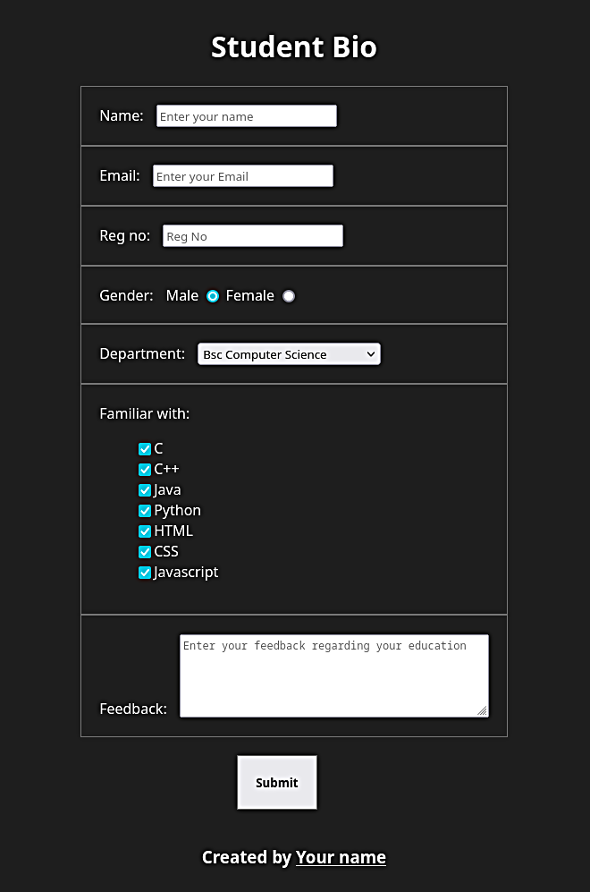

<h1 align=center><b>Creating Student Bio Form - with HTML & CSS</b></h1>

<br>

## **HTML**
```html

<!DOCTYPE html>
<html lang="en">
<head>
    <title>Student Bio</title>
    <style>
        body {
            display: grid;
            place-items: center;
            background: #1E1E1E;
            color:white;
            font-family: sans-serif;
        }
        main > form > * {
            border: 1px solid #626262;
            border-collapse: collapse;
            padding: 20px;
        }
        label {
            margin-right: 10px;
        }
        button {
            padding: 10px;
            margin: 20px 0 20px 175px;
        }
    </style>
</head>
<body>

    <header>
        <h1>Student Bio</h1>
    </header>

    <main>
        <form>
            <div>
                <label>Name: </label>
                <input type="text" placeholder="Enter your name" required>
            </div>
            <div>
                <label>Email: </label>
                <input type="email" required placeholder="Enter your Email">
            </div>
            <div>
                <label>Reg no: </label>
                <input type="text" min="1" max="9" placeholder="Reg No" required>
            </div>
            <div>
                <label>Gender: </label>
                <span>Male </span>
                <input name="gender" value="male" type="radio">
                <span>Female</span>
                <input name="gender" value="female" type="radio">
            </div>
            <div>
                <label>Department: </label>
                <select>
                        <option disabled value>Select an option</option>
                        <option>Bsc Computer Science</option>
                        <option>Bsc Information Technology</option>
                        <option>Bsc Cyber Security</option>
                        <option>Bsc Computer Technology</option>
                        <option>Other</option>
                </select>
            </div>
            <div>
                <label>Familiar with: </label>
                <ul style="list-style: none;">
                    <li> <input type="checkbox">C </li>
                    <li> <input type="checkbox">C++ </li>
                    <li> <input type="checkbox">Java </li>
                    <li> <input type="checkbox">Python </li>
                    <li> <input type="checkbox">HTML </li>
                    <li> <input type="checkbox">CSS </li>
                    <li> <input type="checkbox">Javascript </li>
                </ul>
            </div>
            <div>
                <label>Feedback: </label>
                <textarea cols="40" rows="5" placeholder="Enter your feedback regarding your education"></textarea>
            </div>
            <button type="submit">Submit</button>
        </form>
    </main>

    <footer>
        <h3>Created by Your name</h3>
    </footer>
</body>
</html>
```
<br>

## **OUTPUT**

<div align=center>

</div>