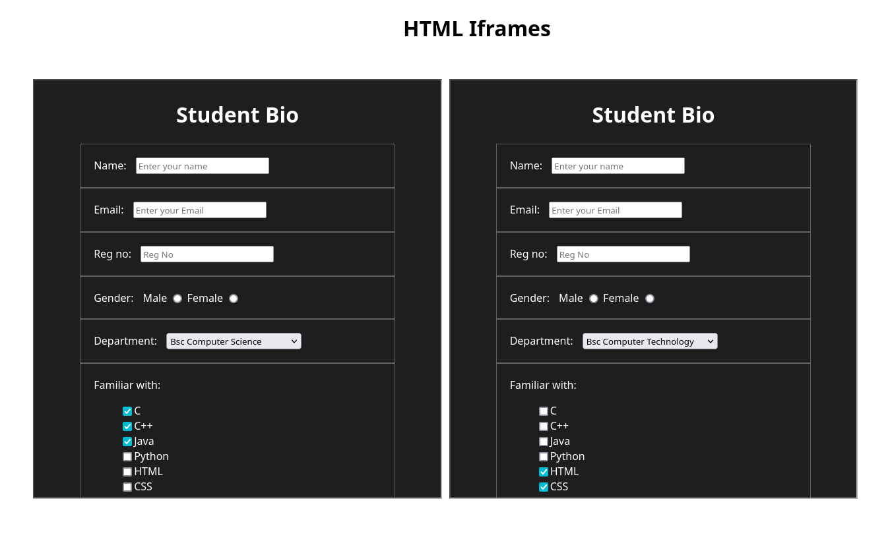

<h1 align=center><b>Demonstrating Iframe with Simple Example - with HTML & CSS</b></h1>

<br>

> **Note**  
>> We are using the previous source code of *form.html* to implement Iframe in our HTML

<br>

## **HTML**
```html

<!DOCTYPE html>
<html lang="en">
<head>
    <title>Iframe Example</title>
    <style>
        * {
            padding: 0;
            margin: 0;
        }
        body{
            display: grid;
            grid-template-columns: 1fr 1fr;
            min-height: 100vh;
            padding: 120px 50px;
            gap: 15px;
            font-family: sans-serif;
        }
        header{
            position: absolute;
            width: 100%;
            text-align: center;
            top: 0;
        }
        iframe {
            width: 100%;
            height: 100%;
        }
    </style>
</head>
<body>

    <header>
        <h1>HTML Iframes</h1>
    </header>

        <!--  Don't forget to give correct path
              of form.html file  -->

    <iframe src="../form.html"></iframe>
    <iframe src="../form.html"></iframe>
    
</body>
</html>
```
<br>

## **OUTPUT**

<div align=center>

</div>